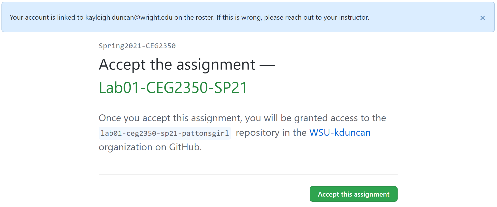

# Guide to Lab Access

## Setup:

- Have a GitHub account

## Instructions

The Pilot page for this course contains a link to a repository to use in this course. Each lab may work a little differently, but in general you will be creating a new folder in this repo corresponding to the lab and adding the requested files / folders there.

- [Setup](#Setup)
- [How to use](#How-to-use)

### Setup

- A repository has been created for you for use in this course. Each lab may work a little differently, but in general you will be creating a new folder in this repo corresponding to the lab and adding the requested files / folders there.
- Select your wright.edu email address from the list shown.
- Select `OK` on the popup to confirm you selected the correct email address.
  
- Select `Accept this assignment`
- After a minute, refresh the next page. You'll see something similar to:
  
- Click the lower link / link that looks similar to: `https://github.com/WSU-kduncan/spring2021-ceg2350-your_GitHub_username`. The top link sometimes presents an "error" but things are actually fine.
- It may be convenient to bookmark this link for easy access.

### How to use

- The repositories created in this course are **private**. The only people with access are you, me, and the TAs for this course.
- Your answers to the labs are generally going to go in a `README.md` file in a folder corresponding to the lab number. Each lab may work a little differently and have you add additional files and folders.
- To `clone` the repository:
  - Click the green `Code` button
  - Select `HTTPS` for username + password authentication or `SSH` for SSH key authentication
    - Ask in class, the Discord channel, or lab for assistance
  - In a terminal use `git clone` followed by the corresponding URL to clone your repository
